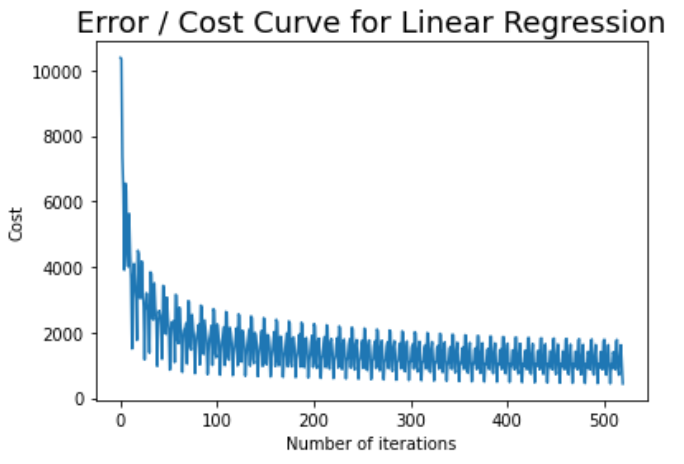
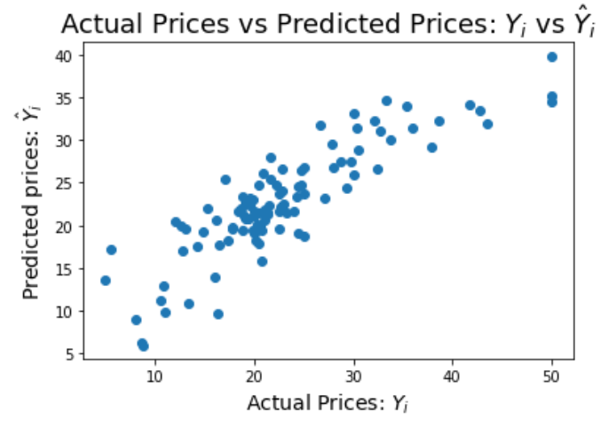
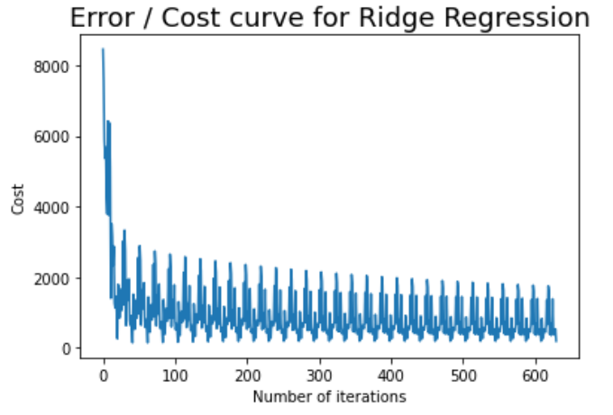
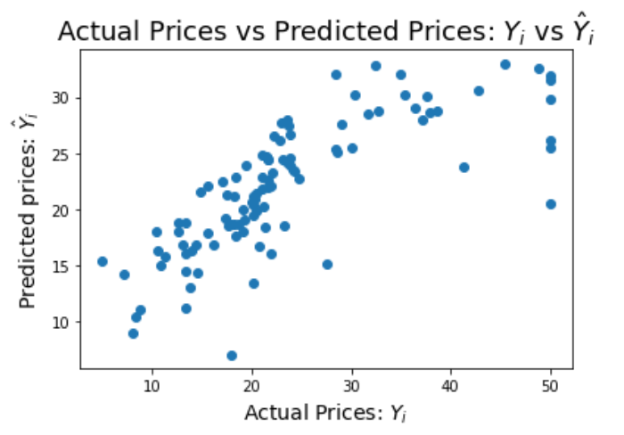
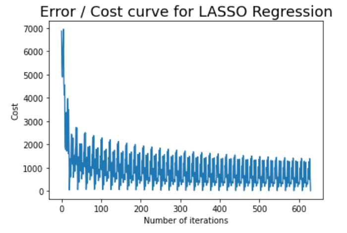
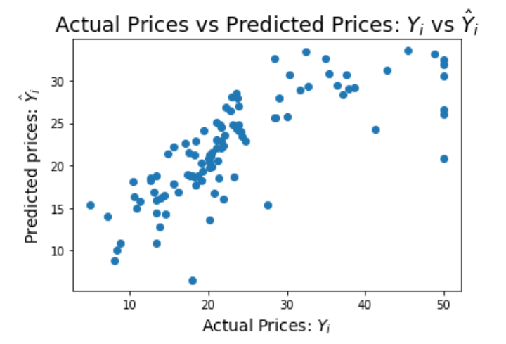

# Linear-Ridge-LASSO-Regression

## Problem statement:

Implement Linear Regression, Ridge Regression, and LASSO algorithms on a small data set, e.g. the Boston Housing Dataset (https://scikit-learn.org/stable/modules/generated/sklearn.datasets. load_boston.html), and compare the performance of each algorithm.

## Solution

The learning objective for all the three models differ by the regularization of the L1 / L2 penalty parameters. For linear regression, the cost function is given by E(w) = wT XT Xw − 2wT XT y + yT y and the model weights are learned via the gradients computed by: (2XT X w − 2 XT y). For Ridge Regression, the cost function is given by E(w) = wT XT X w − 2 wT XT y + yT y + λ||w||2 2 and its gradients are computed by (2XT X w − 2 XT y + 2 λ w). For LASSO Regression, the cost functino is computed by E(w) = wT XT X w − 2 wT XT y + yT y + λ ||w||1 and its gradients are computed by (2XT X w − 2 XT y + λ) if the weights are positive, (2XT X w − 2 XT y − λ) if the weights are negative, and between [−2XT y + λ, −2X T y − λ] if the weights are zero. As we see, the cost and gradients of all three models differ by their regularization methods which control the weight updation in each of the models.

### Linear Regression:

Mean Square Error: 21.0060543102941

 

### Ridge Regression:

Mean Square Error: 55.53465972319111

 

### LASSO:

Mean Square Error: 53.32452986795816
